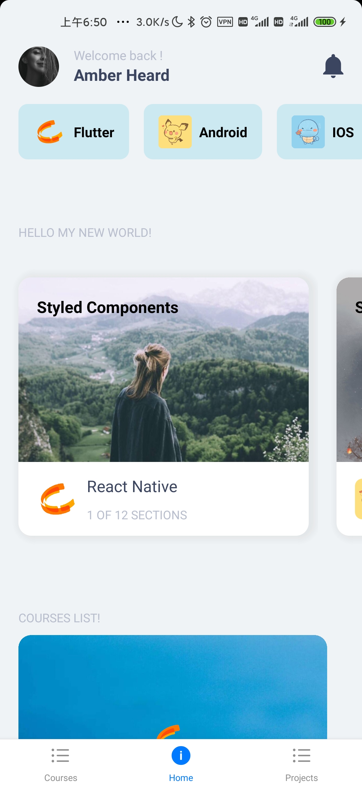

# Learn-React-Native-with-expo
Learn-React-Native-with-expo

- # 这是一个基于expo的react-native应用开发学习Demo
  | 1                           |   2   |    3 |
  | :-------------------------- | :---: | ---: |
  |  |       |      |

- # 食用说明
  - expo官方文档
    - https://docs.expo.io
   - 视频资源
     - https://www.bilibili.com/video/BV1j7411o7ys?p=1 
  - 运行环境需要
    - node.js
    - git
    - npm [node.js自带]
    - yarn
  - 初次启动
    - 运行 `yarn install` 安装所有依赖
- # expo的使用
    - ## 创建一个程序
        - 到指定目录下，cmd运行
        - `expo init `
    - ## 启动调试
        - cmd运行
        - `expo start`
    - ## 退出调试
        - Ctrl+C
  